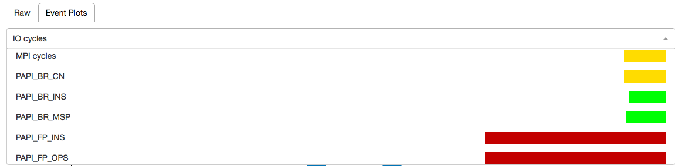

In this post we will look at how `papiex` can be used to analyze an MPI application. The [program we will look at](https://computing.llnl.gov/tutorials/mpi/samples/C/mpi_wave.c) solves a concurrent wave equation using point-to-point communications.

* TOC
{:toc}


## Build Papiex

Let's download and build `papiex`:
```
$ git clone https://github.com/tushar-mohan/perftools.git
$ cd perftools
```

Before we start the build, let's make sure we have the build dependencies:
```
$ ./build.sh --checkdeps
Checking dependencies.. 
gcc.. ok
g++.. ok
gfortran.. ok
mpicc.. ok
mpirun.. ok
patch.. ok
curl.. ok
python.. ok
cmake.. ok
autoconf.. ok
bunzip2.. ok

All build dependencies satisfied.
```

If you encounter problems with build dependencies, [check out the documentation](https://github.com/tushar-mohan/perftools/blob/master/README.md#build-dependencies) for your Linux distro.

Let's fire the build. We will use the defaults, and do a build of `papiex` and
its dependencies. If you also want to build hpctoolkit, you should add
`--all` argument to the following command.

```
$ ./build.sh
```

If all goes well, the output will contain something like:

```
=======================================================================
Tools are installed in:
/home/tushar/perftools/perftools-1.2.1

To use the tools
----------------
module load /home/tushar/perftools/perftools-1.2.1/perftools
	   - or -
source /home/tushar/perftools/perftools-1.2.1/perftools.sh
	   - or -
source /home/tushar/perftools/perftools-1.2.1/perftools.csh

To test install:
make test
make fulltest
=======================================================================
```

So, the tools were built, and installed in the subdirectory `perftools-1.2.1`.

Running a sanity test:
```
$ make test
...
basic-ng: papiex on serial, unthreaded program
basic-ng: PASSED

1 of 1 PASSED
```

If the test fails, you may need to [enable performance counter access for ordinary users](https://github.com/tushar-mohan/perftools/blob/master/README.md#enable-access-to-cpu-counters).

Let's add perftools to our shell environment:
```
$ module load /home/tushar/perftools/perftools-1.2.1/perftools
```

You may also want to add the above command to our `.login` or `.profile`.

At this point, we have `papiex` in our `PATH`:
```
$ papiex -V
PerfTools version 1.2.1
papiex driver version 1.2.6
PAPI library version 5.4.0
PAPI header version 5.4.1
Build Feb 26 2018 16:07:35
```

## Download and build mpiwave
```
$ mkdir mpiwave; cd mpiwave
$ curl https://computing.llnl.gov/tutorials/mpi/samples/C/mpi_wave.c | sed /draw_wave/d > mpi_wave.c
$ mpicc -g -O2 -o mpi_wave mpi_wave.c -lm
```
We use `sed` to remove references to a `draw_wave` function, which is not pertinent to this study.


## Run mpiwave under papiex
Running the program under `papiex` is simple:

```
$ cd mpiwave
$ mpirun -np 16 papiex -a  ./mpi_wave
Starting mpi_wave using 16 tasks.
Using 800 points on the vibrating string.
Enter number of time steps (1-10000): 
10000
...
```

Once the run finishes, `papiex` will create per-rank statistics in a
sub-directory and a top-level summary file:
```
$ ls 
mpi_wave  mpi_wave.c  mpi_wave.papiex.gulftown.4948.1  mpi_wave.papiex.gulftown.4948.1.report.txt
$ cat mpi_wave.papiex.gulftown.4948.1.report.txt
papiex version                : 1.2.6
papiex build                  : Feb 26 2018/16:07:35
Executable                    : /home/tushar/mpiwave/mpi_wave
Processor                     : Intel(R) Xeon(R) CPU           X5650  @ 2.67GHz
Clockrate (MHz)               : 2660.000000
Hostname                      : gulftown
Options                       : MULTIPLEX,MEMORY,PAPI_TOT_INS,PAPI_FP_INS,PAPI_LST_INS,PAPI_BR_INS,PAPI_LD_INS,PAPI_SR_INS,PAPI_TOT_CYC,PAPI_RES_STL,PAPI_L1_DCM,PAPI_L1_ICM,PAPI_TLB_DM,PAPI_TLB_IM,PAPI_L2_DCM,PAPI_L2_ICM,PAPI_BR_CN,PAPI_BR_MSP,PAPI_FP_OPS,PAPI_L2_DCA,PAPI_L2_ICA,NEXTGEN
Domain                        : User
Parent process id             : 4938
Process id                    : 4954
Start                         : Tue Feb 27 15:52:17 2018
Finish                        : Tue Feb 27 15:52:23 2018
Num. of tasks                 : 16

Global derived data:

MFLOPS wallclock .............................  1.90795e-01
MFLOPS .......................................  5.96788e-03
IPC ..........................................  6.94317e-01
Flops Per Load Store .........................  9.09343e-05
Flops Per L1 Data Cache Miss .................  1.26560e-02
Load Store Ratio .............................  2.21776e+00
Instructions Per Dcache Miss .................  2.41626e+02

Time:
Wallclock seconds ............................  6.11238e+00
IO seconds ...................................  4.94118e-02
Resource Stall seconds .......................  7.00915e-01
FP Stall seconds .............................  4.38425e-04

Cycles:
Cycles In Domain .............................  3.20677e+10
Real Cycles ..................................  5.21106e+11
Running Time In Domain % .....................  6.15377e+00
Virtual Cycles ...............................  2.42957e+11
IO Cycles % ..................................  2.52224e-02
MPI Cycles % .................................  4.63798e+01
MPI Sync Cycles % ............................  0.00000e+00

Instructions:
Total Instructions ...........................  2.22651e+10
Memory Instructions % ........................  5.76002e+01
Memory Instructions % ........................  5.76002e+01
FP Instructions % ............................  5.17285e-03
Branch Instructions % ........................  2.32254e+01

Memory:
Load Store Ratio .............................  2.21776e+00
L1 Data Misses Per 1000 Load Stores ..........  7.18509e+00
L1 Data Misses Per 1000 Load Stores ..........  7.18509e+00
L1 Instruction Misses Per 1000 Instructions ..  1.45460e+00
L2 Data Misses Per 1000 L2 Load Stores .......  7.31839e+01
L2 Instruction Misses Per 1000 L2 Instructions   2.87965e+02
Data TLB Misses Per 1000 Load Stores .........  7.45501e-02
Instruction TLB Misses Per 1000 Instructions .  3.54490e-01
L1 Bandwidth MBytes per second ...............  1.67853e+04

Stalls:
Resource Stall Cycles % ......................  5.81405e+00

Branch Misprediction % .......................  7.86574e-03

...
Global counts data:
Event                                           Sum          Min          Max          Mean         CV          
IO cycles ....................................  1.31435e+08  1.61933e+06  1.23498e+07  8.21470e+06  5.09044e-01
MPI Sync cycles ..............................  0.00000e+00
MPI cycles ...................................  2.41688e+11  5.45499e+07  1.61163e+10  1.51055e+10  2.57267e-01
Mem. heap KB .................................  2.03140e+05  1.26880e+04  1.28200e+04  1.26962e+04  2.51666e-03
Mem. library KB ..............................  1.42912e+05  8.93200e+03  8.93200e+03  8.93200e+03  0.00000e+00
Mem. locked KB ...............................  0.00000e+00
Mem. resident peak KB ........................  2.18444e+05  1.35160e+04  1.43240e+04  1.36528e+04  1.40227e-02
Mem. shared KB ...............................  1.04796e+05  6.46400e+03  6.68400e+03  6.54975e+03  9.35446e-03
Mem. stack KB ................................  7.38400e+03  4.52000e+02  4.68000e+02  4.61500e+02  9.12909e-03
Mem. text KB .................................  1.28000e+02  8.00000e+00  8.00000e+00  8.00000e+00  0.00000e+00
Mem. virtual peak KB .........................  0.00000e+00
PAPI_BR_CN ...................................  2.91899e+09  1.23244e+07  2.09682e+08  1.82437e+08  2.45820e-01
PAPI_BR_INS ..................................  5.17116e+09  1.86565e+07  3.68398e+08  3.23198e+08  2.48730e-01
PAPI_BR_MSP ..................................  4.06750e+05  7.82800e+03  7.04680e+04  2.54219e+04  8.30503e-01
PAPI_FP_INS ..................................  1.15174e+06  3.00000e+00  1.15170e+06  7.19839e+04  3.87282e+00
PAPI_FP_OPS ..................................  1.16621e+06  3.00000e+00  1.16617e+06  7.28882e+04  3.87282e+00
PAPI_L1_DCM ..................................  9.21470e+07  9.76134e+05  8.70715e+06  5.75919e+06  4.01360e-01
PAPI_L1_ICM ..................................  3.23868e+07  5.80273e+05  4.63475e+06  2.02417e+06  5.39519e-01
PAPI_L2_DCA ..................................  9.21470e+07  9.76134e+05  8.70715e+06  5.75919e+06  4.01360e-01
PAPI_L2_DCM ..................................  6.74368e+06  1.22628e+05  1.12168e+06  4.21480e+05  6.64362e-01
PAPI_L2_ICA ..................................  2.49389e+06  9.77630e+04  4.18479e+05  1.55868e+05  4.51171e-01
PAPI_L2_ICM ..................................  7.18155e+05  5.51000e+02  8.87580e+04  4.48847e+04  6.52929e-01
PAPI_LD_INS ..................................  8.83915e+09  1.79181e+07  6.35227e+08  5.52447e+08  2.54676e-01
PAPI_LST_INS .................................  1.28248e+10  2.69933e+07  9.20272e+08  8.01547e+08  2.54441e-01
PAPI_RES_STL .................................  1.86443e+09  1.55340e+07  1.81292e+08  1.16527e+08  3.64752e-01
PAPI_SR_INS ..................................  3.98561e+09  9.07517e+06  2.85045e+08  2.49101e+08  2.54034e-01
PAPI_TLB_DM ..................................  9.56087e+05  2.33280e+04  1.00804e+05  5.97554e+04  3.24495e-01
PAPI_TLB_IM ..................................  7.89276e+06  4.70300e+03  7.45376e+06  4.93298e+05  3.64328e+00
PAPI_TOT_CYC .................................  3.20677e+10  9.65905e+07  2.44788e+09  2.00423e+09  2.54396e-01
PAPI_TOT_INS .................................  2.22651e+10  8.53873e+07  1.59859e+09  1.39157e+09  2.47673e-01
Real cycles ..................................  5.21106e+11  3.25559e+10  3.25905e+10  3.25691e+10  3.50867e-04
Real usecs ...................................  1.95415e+08  1.22085e+07  1.22214e+07  1.22134e+07  3.50744e-04
Virtual cycles ...............................  2.42957e+11  1.69785e+08  1.62038e+10  1.51848e+10  2.55312e-01
Virtual usecs ................................  9.13371e+07  6.38310e+04  6.09165e+06  5.70857e+06  2.55312e-01
Wallclock usecs ..............................  6.11238e+06  6.11141e+06  6.11718e+06  6.11381e+06  2.99300e-04
...
```
The [papiex summary report](sample-papiex-report.txt) contains a wealth of data about individual ranks, threads and global job-level statistics.

### Generating CSV with papiex
To view the papiex data in PerfBrowser Cloud, we need the output to be in
CSV format.  We repeat the run, but this time we add `--csv` to the mix.

```
$ mpirun -np 16 papiex -a --csv ./mpi_wave
```


## Visualizing in PerfBrowser Cloud

Things get more interesting if we upload data to [PerfBrowser Cloud](https://perfbrowser.perftools.org)!

If you haven't done so, [sign up for a free-trial PerfBrowser Cloud account](https://perfbrowser.perftools.org/static/index.html#/signup). If you login using OAuth, make sure you set a new password. You will
need the password in the following step, when we upload the data using `pbctl`.

### Setup pbctl
`pbctl` is a command-line utility to upload data to PerfBrowser Cloud

```
$ curl https://raw.githubusercontent.com/tushar-mohan/pbctl/master/pbctl -o $HOME/bin/pbctl
$ chmod +x $HOME/bin/pbctl
$ pbctl version
1.1.4
```

The first time you use `pbctl`, you will need to authenticate:
```
$ pbctl login
Username or email: test123@example.com
Password: 
Login successful (token saved)
```

### Upload papiex csv using pbctl
Now, let's upload the data:
```
$ pbctl import *.csv
input contains 33 lines (including header)
Uploading 62879 bytes..
{
  "id": 7, 
  "info": {
    "nnodes": 1, 
    "nodes": [
      "gulftown"
    ], 
    "nranks": 16
  }, 
  "name": "ADOZCYWPVT", 
  "userId": 1, 
  "webUrl": "https://perfbrowser.perftools.org/static/index.html#/jobs/7"
}
import of mpi_wave.papiex.gulftown.5688.1.csv successful
```

### View in a browser
If you copy-paste the `webUrl` emitted by `pbctl import` in a browser, you will be
directed to the job page, and see something like:


The above view shows how the counts for `IO cycles` varies across the job processes.

If you click the dropdown, you will be presented with a list of events. Corresponding
to each event is a horizontal colored bar, with the color and width of the bar, 
representing the *coefficient of variation* of the event across the tasks. The
coefficient of variation is a measure of the degree of imbalance of the event
across tasks.



As you can see above, there is a dark red long bar for `PAPI_FP_OPS`, signifying a high
degree of imbalance across tasks for the event. Sure, enough on selecting it we see as below:


`PAPI_FP_OPS` represents the floating point operations performance by the process. In this
case we see the FP workload is very unevenly distributed.
